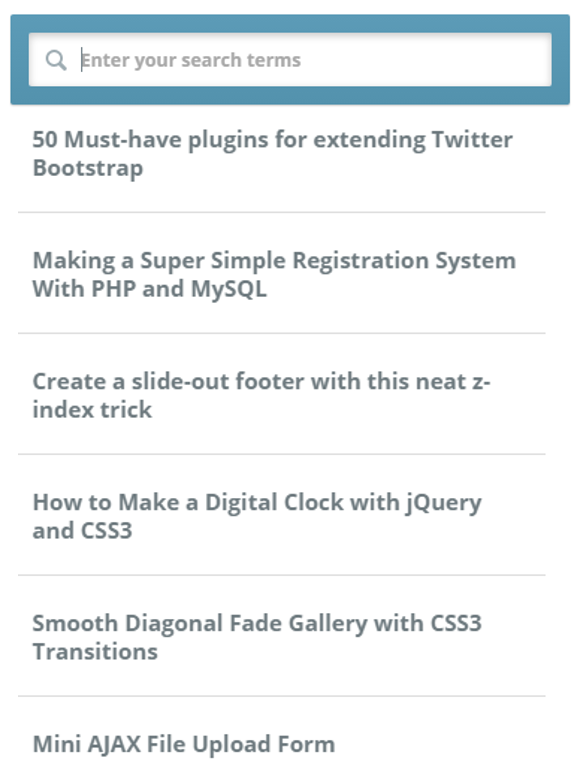

# CS569 Workshop 01
Create a new Angular project with Angular RouterModule support.
Create a service with a method `getPosts()` that returns an observable with the following JSON:
```json
[
  {
    "id": 1,
    "title": "sunt aut facere repellat provident occaecati excepturi optio reprehenderit",
    "body": "quia et suscipit\nsuscipit recusandae consequuntur expedita et cum\nreprehenderit molestiae ut ut quas totam\nnostrum rerum est autem sunt rem eveniet architecto"
  },
  {
    "id": 2,
    "title": "qui est esse",
    "body": "est rerum tempore vitae\nsequi sint nihil reprehenderit dolor beatae ea dolores neque\nfugiat blanditiis voluptate porro vel nihil molestiae ut reiciendis\nqui aperiam non debitis possimus qui neque nisi nulla"
  },
  {
    "id": 3,
    "title": "ea molestias quasi exercitationem repellat qui ipsa sit aut",
    "body": "et iusto sed quo iure\nvoluptatem occaecati omnis eligendi aut ad\nvoluptatem doloribus vel accusantium quis pariatur\nmolestiae porro eius odio et labore et velit aut"
  },
  {
    "id": 4,
    "title": "eum et est occaecati",
    "body": "ullam et saepe reiciendis voluptatem adipisci\nsit amet autem assumenda provident rerum culpa\nquis hic commodi nesciunt rem tenetur doloremque ipsam iure\nquis sunt voluptatem rerum illo velit"
  },
  {
    "id": 5,
    "title": "nesciunt quas odio",
    "body": "repudiandae veniam quaerat sunt sed\nalias aut fugiat sit autem sed est\nvoluptatem omnis possimus esse voluptatibus quis\nest aut tenetur dolor neque"
  },
  {
    "id": 6,
    "title": "dolorem eum magni eos aperiam quia",
    "body": "ut aspernatur corporis harum nihil quis provident sequi\nmollitia nobis aliquid molestiae\nperspiciatis et ea nemo ab reprehenderit accusantium quas\nvoluptate dolores velit et doloremque molestiae"
  },
  {
    "id": 7,
    "title": "magnam facilis autem",
    "body": "dolore placeat quibusdam ea quo vitae\nmagni quis enim qui quis quo nemo aut saepe\nquidem repellat excepturi ut quia\nsunt ut sequi eos ea sed quas"
  },
  {
    "id": 8,
    "title": "dolorem dolore est ipsam",
    "body": "dignissimos aperiam dolorem qui eum\nfacilis quibusdam animi sint suscipit qui sint possimus cum\nquaerat magni maiores excepturi\nipsam ut commodi dolor voluptatum modi aut vitae"
  },
  {
    "id": 9,
    "title": "nesciunt iure omnis dolorem tempora et accusantium",
    "body": "consectetur animi nesciunt iure dolore\nenim quia ad\nveniam autem ut quam aut nobis\net est aut quod aut provident voluptas autem voluptas"
  },
  {
    "id": 10,
    "title": "optio molestias id quia eum",
    "body": "quo et expedita modi cum officia vel magni\ndoloribus qui repudiandae\nvero nisi sit\nquos veniam quod sed accusamus veritatis error"
  }
]
```
1. The root route will display posts' title in a re-usable `<post>` component.  
2. Add a new route to display posts' body. Pass the body as extra state with the navigation.
3. Implement a pipe to support a live search feature that filters down the posts list and display only posts that match the string users are searching for. 
  
<p align="center">
  
</p>
